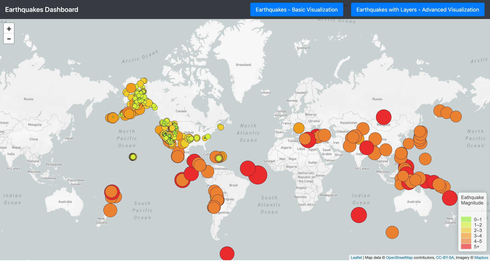
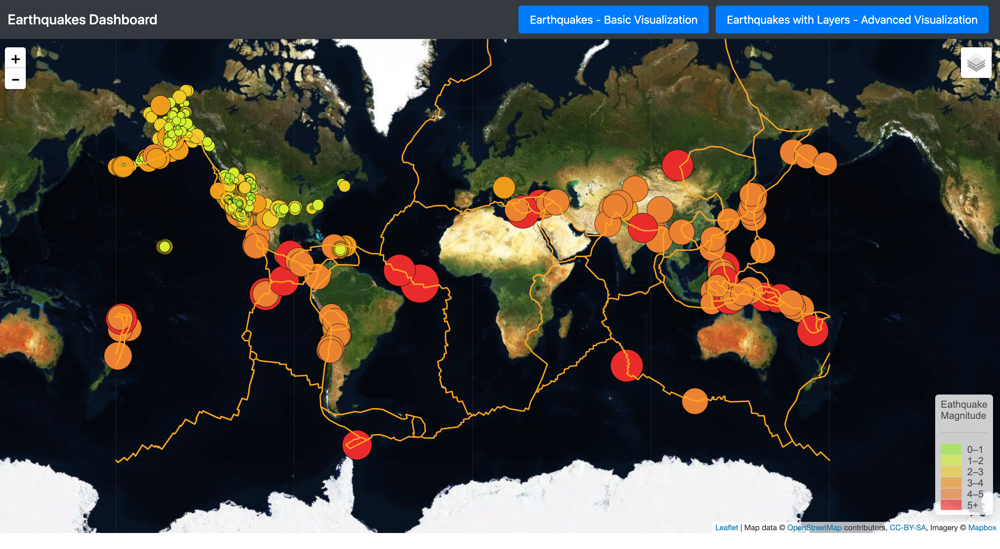

# Leaflet Homework - Visualizing Data with Leaflet

## Background

This respository uses United States Geological Survey, or USGS for short! data wich is responsible for providing scientific data about natural hazards, the health of our ecosystems and environment; and the impacts of climate and land-use change. Their scientists develop new methods and tools to supply timely, relevant, and useful information about the Earth and its processes.

In this project I visualized their earthquake data using html,Javascript, and Leaflet.

## The Task

### Level 1: Basic Visualization

I used [USGS GeoJSON Feed](http://earthquake.usgs.gov/earthquakes/feed/v1.0/geojson.php) to get the data and I visualized All Earthquakes from the Past 7 Days. 
The map looks as follows.

   

2. **Import & Visualize the Data**

   Create a map using Leaflet that plots all of the earthquakes from your data set based on their longitude and latitude.

   * Your data markers should reflect the magnitude of the earthquake in their size and color. Earthquakes with higher magnitudes should appear larger and darker in color.

   * Include popups that provide additional information about the earthquake when a marker is clicked.

   * Create a legend that will provide context for your map data.

   * Your visualization should look something like the map above.

- - -

### Level 2: More Data (Optional)

The USGS wants you to plot a second data set on your map to illustrate the relationship between tectonic plates and seismic activity. You will need to pull in a second data set and visualize it along side your original set of data. Data on tectonic plates can be found at <https://github.com/fraxen/tectonicplates>.

In this step we are going to..

* Plot a second data set on our map.

* Add a number of base maps to choose from as well as separate out our two different data sets into overlays that can be turned on and off independently.

* Add layer controls to our map.

- - -

### Assessment

Your final product will be assessed on the following metrics:

* Completion of assigned tasks

* Visual appearance

* Professionalism

**Good luck!**

### Copyright

Trilogy Education Services © 2019. All Rights Reserved.
